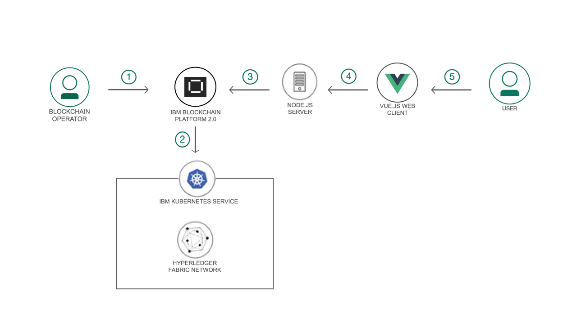
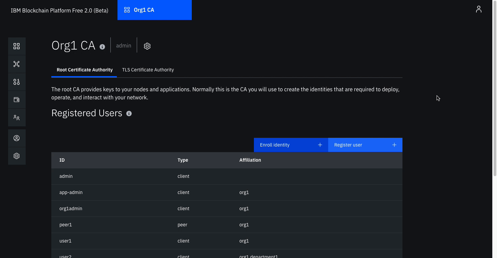

# FabCar Blockchain Sample

>Hyperledger Fabric sample Fabcar on IBM Blockchain Platform

このコードパターンは、IBM Blockchain Platformでネットワークを設定し、Fabcarスマートコントラクトをネットワークに展開する方法を示しています。 次に、IDを含むネットワークとやり取りしてスマートコントラクトでトランザクションを送信するようにアプリケーションをセットアップします。 アプリケーションは、Fabric Node SDKを使用してネットワークへのリクエストを処理するNode.jsサーバーと、Webインターフェースを起動するAngularクライアントでセットアップされます。

このコードパターンを完了すると、次のことができるようになります:

* IBM Blockchain PlatformでHyperledger Fabricネットワークをセットアップする
* IBM Blockchain Platformを介してスマートコントラクトをインストールおよびインスタンス化する
* Hyperledger Fabric SDKを使用してNode.jsサーバーを開発し、展開されたネットワークと対話する
* WebアプリのAngularフロントエンドを作成して、ネットワークとインターフェイスする

# アプリケーション構成図

<p align="center">
  
</p>

VS Code用のIBM Blockchain Platform Extensionを使用して以下を行います。

1. Blockchain Operatorは、IBM Blockchain Platformサービスをセットアップします
2. IBM Blockchain Platformを使用すると、IBM Kubernetes Service上にHyperledger Fabricネットワークを作成でき、ネットワーク上にFabcarスマートコントラクトをインストールしてインスタンス化できます。
3. Node.jsアプリケーションサーバーは、Fabric sdkを使用して、IBM Blockchain Platformにデプロイされたネットワークとやり取りし、Webクライアント用のAPIを作成します
4. AngularクライアントはNode.jsアプリケーションAPIを使用してネットワークと対話します
5.ユーザーは、Fabcar Angular Webインターフェースと対話して、ブロックチェーン台帳と状態を更新および照会します


# 必要なコンポーネント
*	[IBM Blockchain Platform](https://console.bluemix.net/docs/services/blockchain/howto/ibp-v2-deploy-iks.html#ibp-v2-deploy-iks) 
*	[IBM Cloud Kubernetes Service](https://www.ibm.com/cloud/container-service) 
* [IBM Blockchain Platform Extension for VS Code](https://marketplace.visualstudio.com/items?itemName=IBMBlockchain.ibm-blockchain-platform)

## 利用技術
+ [Hyperledger Fabric v1.4](https://hyperledger-fabric.readthedocs.io)
+ [Node.js](https://nodejs.org) 
+ [Express.js](https://expressjs.com/) 
+ [Angular.io](https://angular.io/) 

### 事前準備

- [IBM Cloud account](https://cloud.ibm.com/registration/?target=%2Fdashboard%2Fapps)
- [Node v8.x or greater and npm v5.x or greater](https://nodejs.org/en/download/)
- [VSCode version 1.26 or greater](https://code.visualstudio.com)
- [IBM Blockchain Platform Extension for VSCode](https://marketplace.visualstudio.com/items?itemName=IBMBlockchain.ibm-blockchain-platform)

## アプリケーションの実行

次の手順に従って、このコードパターンをセットアップして実行します。 手順の詳細は以下のとおりです。

### ステップ

> ローカルネットワークで実行する場合は [こちら](./docs/run-local.md) を参照して下さい。

1. [リポジトリのクローン](#1-リポジトリのクローン)
2. [スマートコントラクトのパッケージ](#2-スマートコントラクトのパッケージ)
3. [IBM Cloud サービスの作成](#3-IBM-Cloud-サービスの作成)
4. [ネットワークのビルド](#4-ネットワークのビルド)
5. [FabCarスマートコントラクトのネットワークへのデプロイ](#5-FabCarスマートコントラクトのネットワークへのデプロイ)
6. [アプリケーションのネットワークへの接続](#6-アプリケーションのネットワークへの接続)
7. [アプリケーションの実行](#7-アプリケーションの実行)


## 1. リポジトリのクローン

こちらのリポジトリを任意のローカロフォルダへクローンします:

```bash
git clone https://github.com/IBM/fabcar-blockchain-sample.git
cd fabcar-blockchain-sample
```

## 2. スマートコントラクトのパッケージ

IBM Blockchain Platform拡張機能を使用して、Fabcarスマートコントラクトをパッケージ化します。
* 事前にクローンしたリポジトリ内の `contract` フォルダーを、Visual Studio Codeで開きます。

* 異なるVS Code オプションを表示するには、 `F1`キーを押します。 `IBM Blockchain Platform: Package a Smart Contract Project` を選択します。

* 左側の `IBM Blockchain Platform` 拡張ボタンをクリックします。 これにより、パッケージ化されたコントラクトが上部に、ブロックチェーン接続が下部に表示されます。

* 次に、パッケージ化された契約を右クリックし、 `Export Package` を選択してエクスポートします。

* ローカルマシン上に、 `.cds` ファイルを保存します。 このパッケージスマートコントラクトを使用して後ほどデプロイします。

<p align="center">
  
</p>

次に、IBM Cloud上でHyperledger Fabricネットワークの作成を開始します。

## 3. IBM Cloud サービスの作成

* [IBM Cloud Kubernetes Service](https://cloud.ibm.com/catalog/infrastructure/containers-kubernetes) を作成します。サービスはIBM Cloudから見つけることができます。 このコードパターンでは `無料`クラスターを使用して名前を付けることができます。 IBM Cloudでは、無料クラスターのインスタンスを1つ許可し、30日後に有効期限が切れます。

<br>
<p align="center">
  
</p>
<br>

* IBM Cloud上に [IBM Blockchain Platform](https://console.bluemix.net/catalog/services/blockchain/) サービスを作成します。このサービスは `カタログ` から見つけることができ、任意の名前を付与できます。

<br>
<p align="center">
  
</p>
<br>

* Kubernetesクラスターが稼働したら、クラスターにIBM Blockchain Platformをデプロイできます。IBM Blockchain Platformサービスを作成するステップの中で、サービスをデプロイするIBM Cloud上のクラスターを選択します。

<br>
<p align="center">
  
</p>
<br>

* ブロックチェーンプラットフォームがKubernetesクラスターにデプロイされると、コンソールを起動してブロックチェーンネットワークでの運用を開始できます。

<br>
<p align="center">
  
</p>
<br>

## 4. ネットワークのビルド

IBM Blockchain Platformが提供するネットワークを構築します [ドキュメント](https://console.bluemix.net/docs/services/blockchain/howto/ibp-console-build-network.html#ibp-console-build-network) 。 これには、独自のMSPとCA（認証局）を持つ単一のピア組織と、独自のMSPとCAを持つ注文者組織とのチャネルの作成が含まれます。 ピアを展開してノードを操作するために、それぞれのIDを作成します。


### 組織とブロックチェーンへのエントリポイントを作成します

* #### 組織 CA のピアを作成します
  - <b>認証局の追加</b>をクリックします。
  - <b>IBM Cloud 認証局の作成</b>を選択し<b>次へ</b>をクリックします。
  - <b>CA 表示名</b>に `Org1 CA` を記述します。  
  - <b>CA 管理者登録 ID</b>に `admin` を、<b>CA 管理者登録秘密事項</b>に `adminpw` を記述します。

<br>
<p align="center">
  
</p>
<br>


* #### CAを使用してIDを登録します
  - 作成した<b>Org1 CA</b>認証局を選択します。
  - 最初に、アイデンティティの関連付けを行います。<b>アイデンティティの関連付け</b>ボタンをクリックします。<b>登録ID</b>に `admin` を、<b>登録秘密事項</b>に `adminpw` を指定し、<b>アイデンティティの関連付け</b>をクリックします。
  - 登録済みユーザーの表示画面になるので、組織`org1`の管理者を登録します。<b>ユーザーの登録</b>ボタンをクリックします。<b>登録ID</b>に `org1admin` を、<b>登録秘密事項</b>に ` org1adminpw` を指定し、<b>次へ</b>をクリックします。このIDの<b>Type</b>を `client` に設定し、ドロップダウンリストから関連組織のいずれかを選択します。<b>最大登録</b>および<b>属性の追加</b>フィールドは空白のままにします。
   - 再度ピアのIDを作成するプロセスを行います。<b>ユーザーの登録</b>]ボタンをクリックします。<b>登録ID</b>に `peer1` を、<b>秘密の登録登録秘密事項</b>に ` peer1pw` を指定し、<b>次へ</b>をクリックします。このIDの<b>Type</b>を `peer` に設定し、ドロップダウンリストから関連組織のいずれかを選択します。<b>最大登録</b>および<b>属性の追加</b>フィールドは空白のままにします。

<br>
<p align="center">
  
</p>
<br>


* #### ピア組織のMSP定義を作成します
  - 左側のナビゲーションの<b>組織</b>タブに移動し、<b>MSP定義の作成</b>をクリックします。
  - <b>MSP表示名</b>に`Org1 MSP`と入力し、<b>MSP ID</b>に`org1msp`を入力します。
  - <b>ルート認証局</b>の詳細の下で、組織のルートCAとして`Org1 CA`を作成したピアCAを指定します。
  - 組織管理者のの<b>登録ID</b>に、`org1admin`を、<b>登録秘密事項</b>に、`org1adminpw`を指定します。 次に、ID名`Org1 Admin`を指定します。
  - <b>生成</b>ボタンをクリックして、このIDを組織の管理者として登録し、IDをウォレットにエクスポートします。 <b>エクスポート</b>をクリックして、管理者証明書をファイルシステムにエクスポートします。 最後に、<b>MSP定義の作成</b>をクリックします。

<br>
<p align="center">
  
</p>
<br>


* ピアを作成します
  - <b>ノード</b>ページで、<b>ピアの追加</b>をクリックします。
  - 新しいピアの作成の下の<b>IBM Cloud</b>および<b>次</b>をクリックします。
  - ピアに`Peer Org1`の<b>表示名</b>を付けます。
  - 次の画面で、<b>認証機関</b>として`Org1 CA`を選択します。次に、ピア、`peer1`、`peer1pw`用に作成したピアIDの<b>登録ID </b>および<b>登録秘密事項</b>を指定します。次に、ドロップダウンリストから<b>管理者証明書（MSPから）</b>、`Org1 MSP`を選択し、<b>次</b>をクリックします。
  - <b>TLS登録ID</b>に、`admin`、および<b>TLS登録秘密事項</b>に、`adminpw`を指定します。作成時に指定した登録IDと登録秘密事項と同じです CA。 <b> TLS CSRホスト名</b>は空白のままにします。
  - 最後のサイドパネルでは、<b>IDを関連付ける</b>ように求められ、ピアの管理者になります。ピア管理ID`Org1 Admin`を選択します。
  - 概要を確認し、<b>送信</b>をクリックします。

<br>
<p align="center">
  
</p>
<br>

### トランザクションの順序付け用ノードを作成します

* #### 順序付けサービス組織CAを作成します
  - Click <b>Add Certificate Authority</b>.
  - Click <b>IBM Cloud</b> under <b>Create Certificate Authority</b> and <b>Next</b>.
  - Give it a unique <b>Display name</b> of `Orderer CA`.  
  - Specify an <b>Admin ID</b> of `admin` and <b>Admin Secret</b> of `adminpw`.

<br>
<p align="center">
  
</p>
<br>

* #### CAを使用して、順序付けサービスと順序付けサービス管理者IDを登録します
  - <b>ノード</b>タブで、作成した<b>オーダCA </b>認証局を選択します。
  - 最初に、組織の管理者を登録します。<b>ユーザーの登録</b>ボタンをクリックします。<b>登録ID </b>に`ordereradmin`を、<b>登録秘密事項</b>に`ordereradminpw`を指定します。 <b>次へ</b>をクリックします。このIDの<b> Type</b>を`client`に設定し、ドロップダウンリストから関連組織のいずれかを選択します。 <b>最大登録</b>および<b>属性の追加</b>フィールドは空白のままにします。
  - 注文者のIDを作成するプロセスを繰り返します。 <b>ユーザーの登録</b>ボタンをクリックします。<b>登録ID</b>に`orderer1`を、<b>登録秘密事項</b>に` orderer1pw`を指定します。<b>次へ</b>をクリックします。 このIDの<b>Type </b>を`peer`に設定し、ドロップダウンリストから関連組織のいずれかを選択します。<b>最大登録</b>および[<b>属性の追加</b>フィールドは空白のままにします。

<br>
<p align="center">
  
</p>
<br>


* #### 順序付けサービス組織のMSP定義を作成します
  - 左側のナビゲーションの<b>組織</b>タブに移動し、<b>MSP定義の作成</b>をクリックします。
  - <b>MSP表示名</b>に`Orderer MSP`、<b> MSP ID </b>に`orderermsp`を入力します。
  - <b>ルート認証局</b>の詳細の下で、組織のルートCAとして`注文者CA`を作成したピアCAを指定します。
  - 組織管理者に、`ordereradmin`を、<b>登録ID </b>に、`ordereradminpw`を指定します。 次に、<b>ID名</b>、`Orderer Admin`を指定します。
  - <b>生成</b>ボタンをクリックして、このIDを組織の管理者として登録し、IDをウォレットにエクスポートします。<b>エクスポート</b>をクリックして、管理者証明書をファイルシステムにエクスポートします。最後に、<b>MSP定義の作成</b>をクリックします。

<br>
<p align="center">
  
</p>
<br>

* #### 順序付けサービスを作成します
  - <b>ノード</b>ページで、<b>順序付けサービスの追加</b>をクリックします。
  - <b>IBM Cloud</b>をクリックして、<b>次へ</b>に進みます。
  - ピアに`順序付けサービス`の<b>表示名</b>を付けます。
  - 次の画面で、<b>認証機関</b>として`注文者CA`を選択します。次に、注文者、`orderer1`、`orderer1pw`用に作成したピアIDの<b>登録ID</b>と<b>登録秘密事項</b>を指定します。次に、ドロップダウンリストから<b>Administrator Certificate（from MSP）</b>である`Orderer MSP`を選択し、<b>Next</b>をクリックします。
  - <b> TLS登録ID </b>に、`admin`、および<b>TLS登録秘密事項</b>に、` adminpw`を指定します。CA作成時に指定した登録IDと登録秘密事項と同じです。<b> TLS CSRホスト名</b>は空白のままにします。
  - 最後のサイドパネルでは、<b>IDを関連付ける</b>ように求められ、ピアの管理者になります。ピア管理者ID`Orderer Admin`を選択します。
  - 概要を確認し、<b>送信</b>をクリックします。

<br>
<p align="center">
  
</p>
<br>

* #### トランザクションのために、順序付けサービスにコンソーシアムメンバーとして組織を追加します
注文者に組織をコンソーシアムメンバーとして追加して取引します
  - <b>ノード</b>タブに移動し、作成した<b>注文者</b>をクリックします。
  - <b>コンソーシアムメンバー</b>で、<b>組織の追加</b>をクリックします。
  - ドロップダウンリストから `Org1 MSP` を選択します。これは、ピアの組織org1を表すMSPであるためです。
  - <b>送信</b>をクリックします。

<br>
<p align="center">
  
</p>
<br>


### チャネルを作成しJoinします

* #### チャネルを作成します
  - 左側のナビゲーションタブから<b>チャネル</b>を選択します。 
  - <b>チャネルの作成</b>をクリックします。
  - チャネル名に `mychannel` を設定します。
  - 作成した順序付けサービス `Orderer` を順序付けサービスリストから選択します。
  - 組織セクションで、組織の下のチャネルメンバー `Org1 MSP (org1msp)` を選択します。
  - ドロップダウンリストからチャネル作成者の組織を識別するMSPを選択します。 これは `Org1 MSP (org1msp)` である必要があります。
  - 組織の横にある<b>追加</b>をクリックします。 組織を<b>Operator</b>にします。
  - 「チャネル作成者の組織」セクションで `Org1 Admin` としてIDを選択します。
  - <b>チャネルの作成</b>をクリックします。

<br>
<p align="center">
  
</p>
<br>


* #### Join your peer to the channel
  - <b>チャネルに参加</b>をクリックして、サイドパネルを起動します。
  - `Orderer` を選択して、<b>次へ</b>をクリックします。
  - 作成したばかりのチャネルの名前を入力します。 `mychannel` をクリックし、<b>次へ</b>をクリックします。
  - チャネルに参加したいピアを選択し、 `Peer Org1` をクリックします。
  - <b>チャネルに参加</b>をクリックします。

<br>
<p align="center">
  
</p>
<br>


## 5. FabCarスマートコントラクトのネットワークへのデプロイ


* #### スマートコントラクトをインストールします
  - <b>スマートコントラクト</b>タブをクリックして、スマートコントラクトをインストールします。
  - <b>スマートコントラクトのインストール</b>をクリックして、Visual Studioコード拡張機能を使用して以前にパッケージ化したFabcarスマートコントラクトパッケージファイルをアップロードします。
  - <b>ファイルの追加</b>をクリックして、パッケージ化されたスマートコントラクトを選択します。
  - スマートコントラクトがアップロードされたら、<b>インストール</b>をクリックします。


<br>
<p align="center">
  
</p>
<br>

* #### スマートコントラクトをインスタンス化します
  - スマートコントラクトタブで、ピアにインストールされているリストからスマートコントラクトを見つけ、行の右側のオーバーフローメニューから<b>インスタンス化</b>をクリックします。
  - 開いたサイドパネルで、スマートコントラクトをインスタンス化するチャネル `mychannel` を選択します。<b>次へ</b>をクリックします。
  - ポリシー`org1msp`に含める組織メンバーを選択します。 <b>次へ</b>を2回クリックします。
  - の<b>関数名</b>に `initLedger` を指定し、<b>引数</b>を空白のままにします。
  -　<b>インスタンス化</b>をクリックします。

<br>
<p align="center">
  
</p>
<br>

## 6. アプリケーションのネットワークへの接続

* #### 接続プロファイルを介してSDKに接続します
  - Instantiated Smart Contractの下で、行の右側のオーバーフローメニューから[Connect with SDK]をクリックします。
  - <b>接続用のMSP</b>のドロップダウンから`org1msp`を選択します。
  - <b>証明書機関</b>ドロップダウンの[Org1 CA]から選択します。
  - 下にスクロールして<b>接続プロファイルのダウンロード</b>をクリックして、接続プロファイルをダウンロードします。これにより、すぐに接続を確立するために使用する接続JSONがダウンロードされます。
  - ダウンロードが完了したら、<b>閉じる</b>をクリックします。

<br>
<p align="center">
  
</p>
<br>

* #### アプリ管理者を作成します
  - 左側のバーの<b>ノード</b>タブに移動し、<b>証明書機関</b>で組織のCAである<b>Org1 CA</b>を選択します。
  - <b>ユーザーの登録</b>をクリックします。
  - <b>Enroll ID</b>と<b>Enroll Secret</b>を指定して、アプリケーションユーザーの `app-admin`と` app-adminpw`を管理します。
  - <b>タイプ</b>に<クライアント>を選択します。
  - <b>最大登録数</b>は空白のままでかまいません。
  - <b>属性</b>で、<b>属性の追加</b>をクリックします。属性を  `hf.Registrar.Roles` = `*`　として指定します。 これにより、このIDがレジストラとして機能し、アプリのIDが発行されます。<b>属性の追加</b>をクリックします。
  - <b>登録</b>]をクリックします。

<br>
<p align="center">
  
</p>
<br>


* #### アプリケーション接続を更新します
  - ダウンロードした接続プロファイルを[サーバーフォルダー]（web-app / server）にコピーします
  - [config.json]（web-app / server / config.json）ファイルを次のように更新します。
    - ダウンロードした接続jsonファイル名。
    - アプリ管理者の<b> enroll id </b>および<b> enroll secret </b>。以前に`app-admin`および`app-adminpw`として提供しました。
    - `org1msp`として提供したorgMSP ID。
    - `組織`->`org1msp`-> certificateAuthoritiesの下の接続jsonファイルにあるcaName。これはIPアドレスとポートのようなものです。
    - 登録するユーザー名。
    - IBPに接続するために、ゲートウェイ検出を `{enabled：true、asLocalhost：false}`に更新します。

> デフォルト設定では、VS Codeからローカルファブリックインスタンスに接続するようになっています。

```js
{
    "connection_file": "mychannel_fabcar_profile.json",
    "appAdmin": "app-admin",
    "appAdminSecret": "app-adminpw",
    "orgMSPID": "org1msp",
    "caName": "169.46.208.151:30404",
    "userName": "user1",
    "gatewayDiscovery": { "enabled": true, "asLocalhost": false }
}
```


## 7. アプリケーションの実行

* #### 管理者を登録する
  - 最初に `web-app` ディレクトリに移動し、ノードの依存関係をインストールします。
    ```bash
    cd web-app/server
    npm install
    ```

  - `enrollAdmin.js` を実行します。
    ```bash
    node enrollAdmin.js
    ```

  - ターミナルに次のように表示されれば成功です。
    ```bash
    msg: Successfully enrolled admin user app-admin and imported it into the wallet
    ```

* #### ユーザーを登録する 
  - `registerUser.js` を実行します。
    ```bash
    node registerUser.js
    ```

  - ターミナルに次のように表示されれば成功です。
    ```bash
    Successfully registered and enrolled admin user user1 and imported it into the wallet
    ```


* #### アプリケーションサーバーの起動
  - `server` ディレクトリからサーバーを開始します。

    ```bash
    npm start
    ```

* #### Webクライアントの開始
  - 新しいターミナルで、Webクライアントフォルダーを開き、依存関係をインストールします。
    ```bash
    cd web-app/client
    npm install
    ```

  - クライアントアプリを開始します。
    ```bash
    npm start
    ```

http://localhost:4200/ にアクセスし、実行されているアプリを確認することができます。

<br>
<p align="center">
  
</p>
<br>

IBM Blockchain Platformコンソールにアクセスしてユーザーを監視し、追加されたブロックを含むチャンネルに関する情報を取得できます。

<br>
<p align="center">
  
</p>
<br>


## トラブルシューティング
* If you encounter an error ``discover error: access denied``, you need to set the `gatewayDiscovery` properly in your `config.json` file. This is <b>REQUIRED</b>  You must set it as follows to connect to IBP:

                 `"gatewayDiscovery": {"enabled": true, "asLocalhost": false }`

## リンク
* [Hyperledger Fabric Docs](http://hyperledger-fabric.readthedocs.io/en/latest/)
* [IBM Code Patterns for Blockchain](https://developer.ibm.com/patterns/category/blockchain/)

## ライセンス（英語）
This code pattern is licensed under the Apache Software License, Version 2. Separate third-party code objects invoked within this code pattern are licensed by their respective providers pursuant to their own separate licenses. Contributions are subject to the [Developer Certificate of Origin, Version 1.1 (DCO)](https://developercertificate.org/) and the [Apache Software License, Version 2](https://www.apache.org/licenses/LICENSE-2.0.txt).

[Apache Software License (ASL) FAQ](https://www.apache.org/foundation/license-faq.html#WhatDoesItMEAN)
